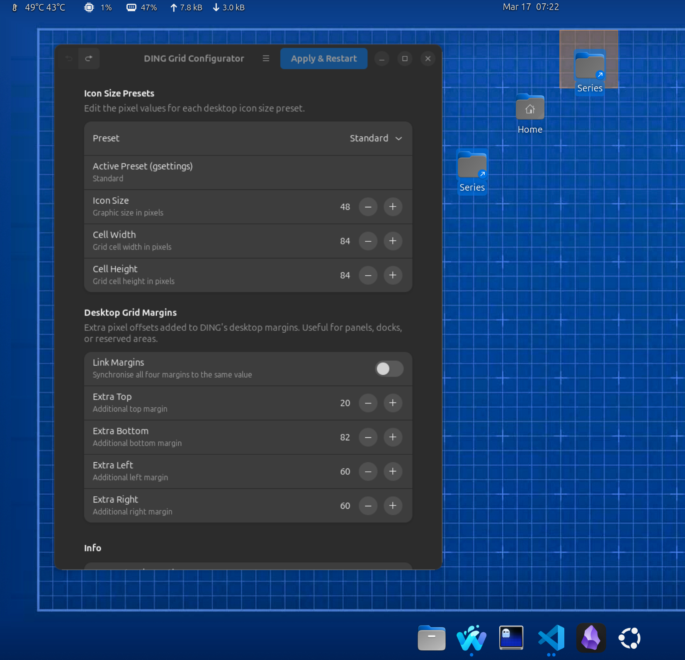

# DING Grid Configurator

A GTK4 + Libadwaita GUI tool for customizing the desktop icon grid in Ubuntu's [DING (Desktop Icons NG)](https://extensions.gnome.org/extension/2087/desktop-icons-ng-ding/) GNOME Shell extension.



## Why This Exists

DING provides four icon size presets (Tiny, Small, Standard, Large) but exposes no GUI for changing the underlying pixel values — icon graphic size, grid cell dimensions, or desktop margins. This tool fills that gap with a clean, native-feeling GNOME preferences interface.

## Features

- Edit icon size, cell width, and cell height for each of the four presets
- Add extra margin offsets to any edge of the desktop (useful for docks, panels, or HiDPI tweaks)
- Link margins to synchronise all four values at once
- Automatic backup of original DING files before any modification
- One-click restore to original defaults
- Applies changes by restarting the DING extension — no logout required

## Requirements

- Ubuntu 24.04 LTS (or any distro with GNOME + DING extension)
- DING extension installed at `/usr/share/gnome-shell/extensions/ding@rastersoft.com/`
- Python 3.12+
- GTK4 + Libadwaita Python bindings

```bash
sudo apt install python3-gi gir1.2-adw-1 gir1.2-gtk-4.0 policykit-1
```

## Install

```bash
git clone https://github.com/darikzen/ding-grid-configurator.git
cd ding-grid-configurator
sudo make install
```

This installs the Python package, a desktop entry (so the app appears in your app launcher), and the PolicyKit policy for privilege escalation.

To uninstall:

```bash
sudo make uninstall
```

Then launch from the app launcher or run:

```bash
ding-grid-configurator
```

### Run without installing

```bash
python3 -m ding_grid_configurator.main
```

Writing to `/usr/share/` requires elevated privileges. The app uses `pkexec` (PolicyKit) to escalate only the file-write step — the GUI itself never runs as root.

## How It Works

### Files Modified

| File | What Changes |
|------|-------------|
| `app/enums.js` | `ICON_SIZE`, `ICON_WIDTH`, `ICON_HEIGHT` JS object literals |
| `app/desktopGrid.js` | `updateUnscaledHeightWidthMargins()` method body |

### Backup & Restore

Before the first write, the app copies both files to `*.bak` siblings. "Restore Defaults" copies them back.

### Extension Restart

After writing, the app runs:
```bash
gnome-extensions disable ding@rastersoft.com
gnome-extensions enable  ding@rastersoft.com
```

## Compatibility

Tested on Ubuntu 24.04 LTS with DING extension v65+, GNOME 46, Wayland.

## License

MIT — see [LICENSE](LICENSE).
